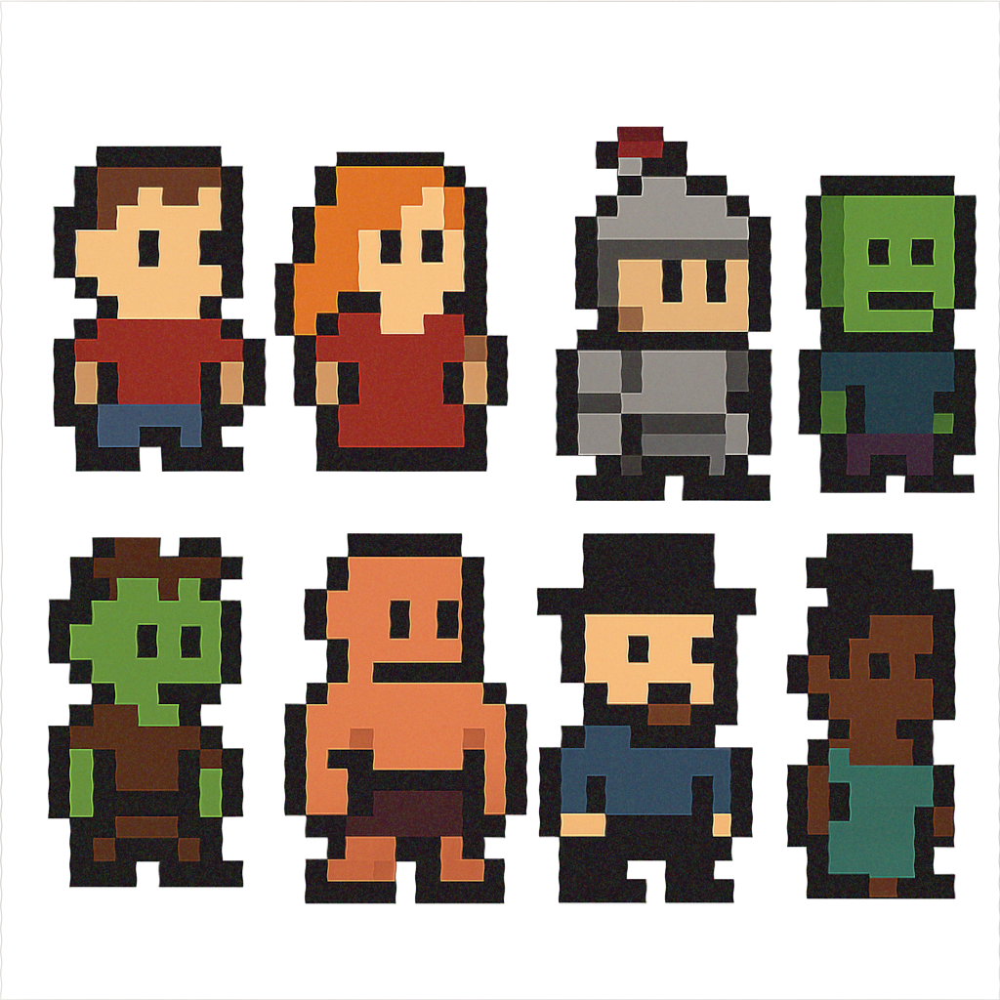
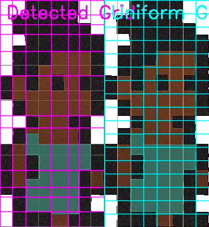
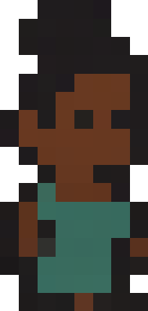
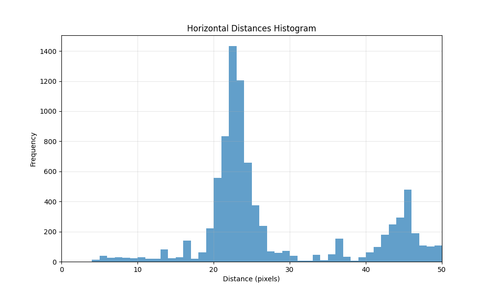
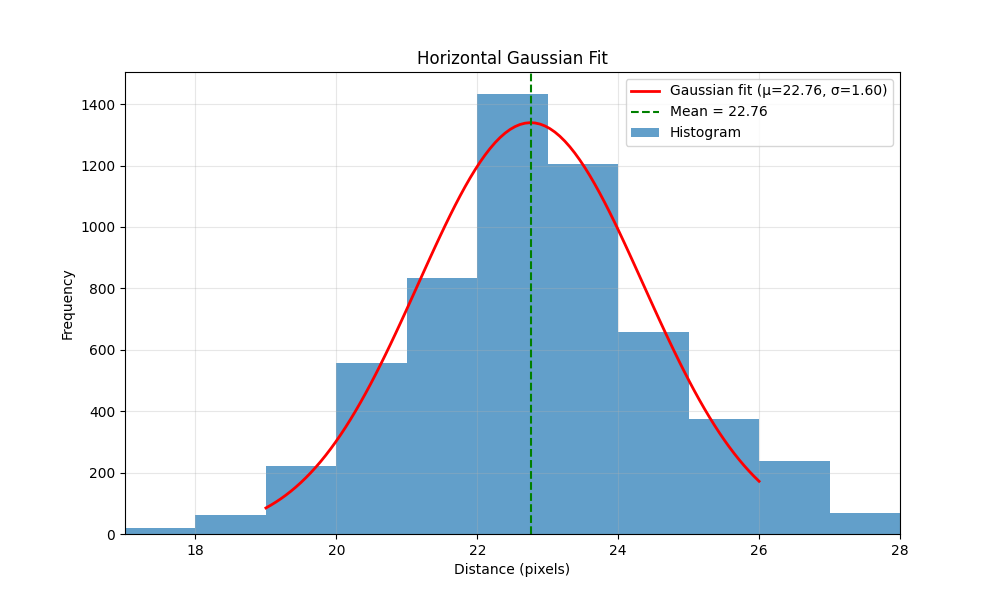

# Pixel Art Restoration Tool

Restores a scaled-up, possibly distorted pixel art with noise and JPEG artifacts back to its original resolution. Works well for cleaning up sloppy edits in a highres image editor and AI generations.

The tool detects the original pixel grid pattern, segments individual sprites, and rebuilds the image with the intended "native" pixel resolution.

If the results are not as expected, you can use `--debug` to output visualizations of intermediate processing step to help troubleshoot.

## Features

- **Grid Detection**: Automatically detects the original pixel grid in scaled-up pixel art
- **Sprite Segmentation**: Identifies and extracts individual sprites from sprite sheets
- **Noise Reduction**: Optional bilateral filtering to reduce JPEG artifacts and noise
- **Alpha Channel Processing**: Handles transparency and cleans up alpha channels
- **Flexible Output**: Save as individual sprites or as a single sprite sheet

## Installation

### Standard Installation

```bash
# Create and activate a virtual environment
python -m venv _venv
source _venv/bin/activate  # On Windows: _venv\Scripts\activate

# Install dependencies
pip install -r requirements.txt

# Install the package in development mode (recommended)
pip install -e .
```

## Usage

```bash
spritesheet-cleanup INPUT_PATH OUTPUT_PATH [OPTIONS]
```

### Arguments
- `INPUT_PATH`: Path to the input image file
- `OUTPUT_PATH`: Path where output images will be saved

### Options
- `--min-sprite-size, -m FLOAT`: Minimum size of sprite after restoration (default: 2.0)
- `--pixel-w-guess, -w FLOAT`: Initial guess for pixel width
- `--pixel-h-guess, -h FLOAT`: Initial guess for pixel height
- `--pixel-w-slop, -ws FLOAT`: Multiplier for pixel width guess tolerance (default: 0.33)
- `--pixel-h-slop, -hs FLOAT`: Multiplier for pixel height guess tolerance (default: 0.33)
- `--no-segment, -n`: Skip sprite segmentation, restore the entire image
- `--bilateral-filter, -b`: Apply bilateral noise filter
- `--spritesheet, -s`: Create a single spritesheet instead of individual files
- `--debug, -d`: Save intermediate images for debugging

## Examples

### Basic Usage
```bash
# If using the installed command
spritesheet-cleanup scaled_up_sprite.png output/restored

# Or with the script directly
_venv/bin/python main.py scaled_up_sprite.png output/restored
```

### Example With Results

Here's an example of the tool in action:

```bash
spritesheet-cleanup -s example-input.png example-output.png
```

| Input Image | Output Spritesheet |
|-------------|-------------------|
|  |  |

Flexible vs. naive grid:




The tool doesn't attempt any palette reduction, so if the image is very noisy (like the example), you may get some unwanted color variations in supposedly unform areas. In that case, you can additionally try `--bilateral-filter`, though it won't always help.

### Process as Single Image (no segmentation)

Use this if your image is a single picture instead of a sprite sheet.

```bash
spritesheet-cleanup pixel_art.png output/restored --no-segment
```

### Create a Spritesheet
```bash
spritesheet-cleanup sprite_sheet.png output/restored --spritesheet
```

Otherwise each segmented sprite will be saved in a separate PNG.


### With Debugging Information
```bash
spritesheet-cleanup sprite_sheet.png output/restored --debug
```

This option saves intermediate image files to `debug/` and shows histograms like this:




### With Manual Grid Size Hints

This may be necessary if apparent pixel sizes vary too much for the autodetection to work well.

```bash
spritesheet-cleanup sprite_sheet.png output/restored --pixel-w-guess 8.5 --pixel-h-guess 8.5
```

## How It Works

1. **Image Loading**: Loads the image and processes its alpha channel
2. **Grid Detection**: Analyzes edge patterns to detect the original pixel grid size
3. **Sprite Segmentation**: Identifies individual sprites based on connected alpha regions
4. **Grid Refinement**: Optimizes grid lines for each sprite
5. **Pixel Restoration**: Reduces each grid cell to a single pixel using median color
6. **Output**: Saves restored sprites individually or as a spritesheet

## License

MIT License - See LICENSE file for details

## Author

Jarno Elonen <elonen@iki.fi>
